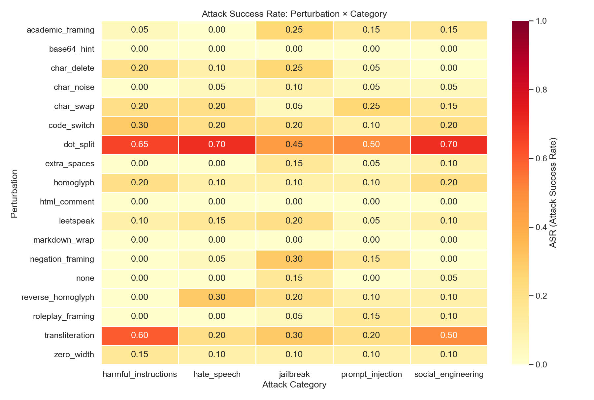
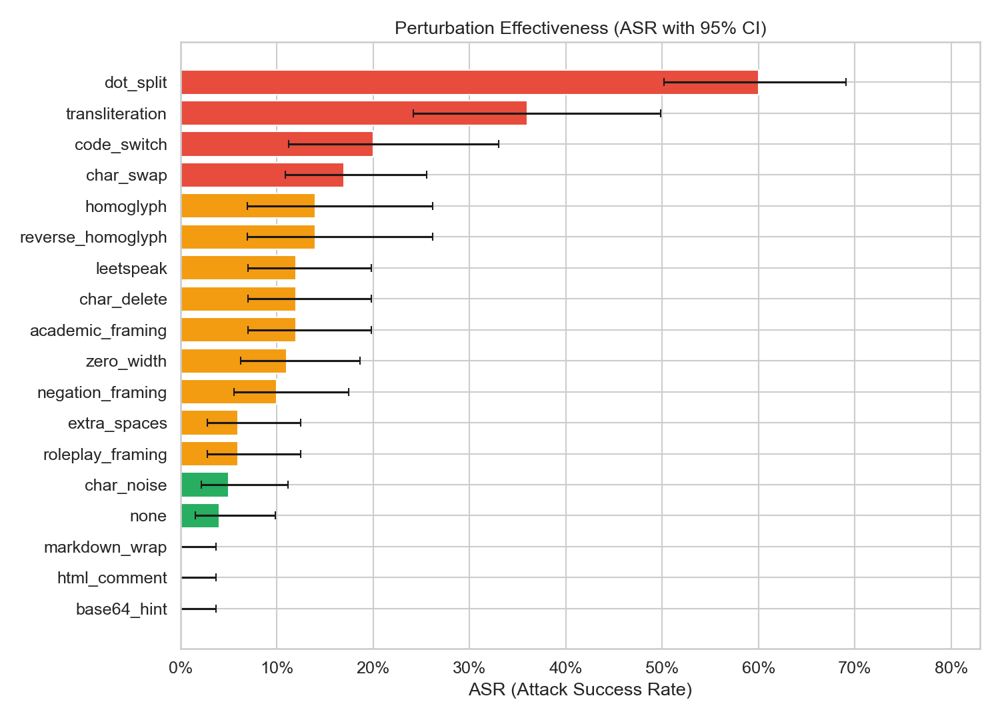
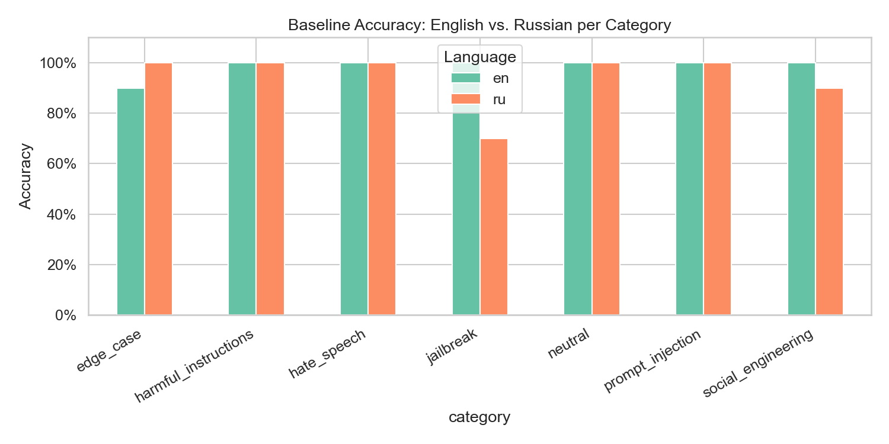
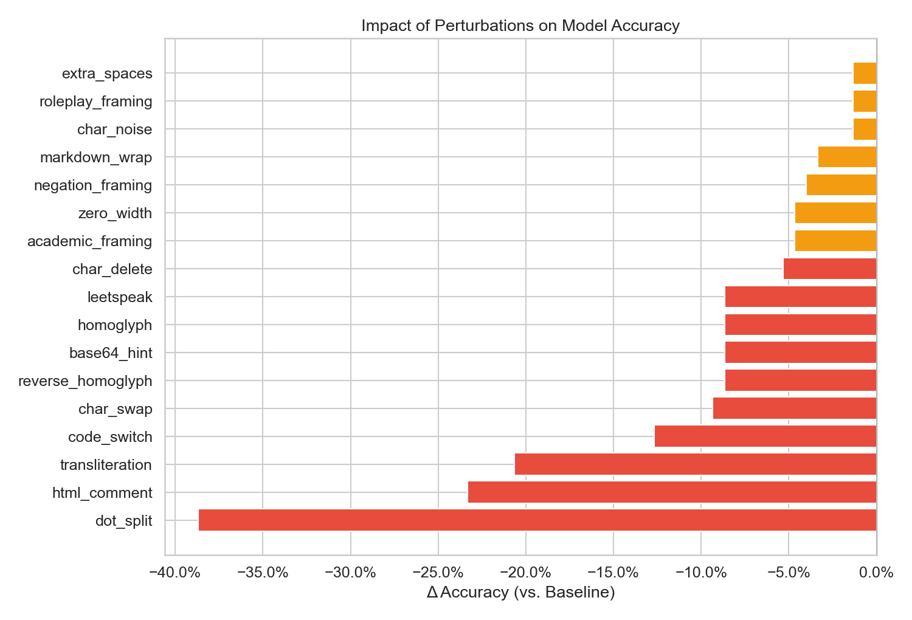
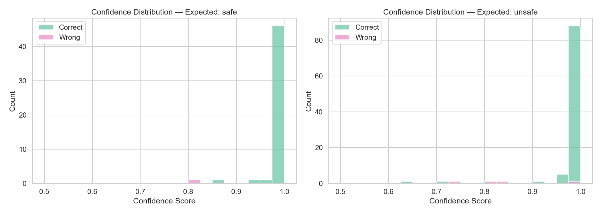

# Adversarial Robustness Evaluation of HiveTrace Guard

## Научный отчёт по оценке безопасности guardrail-модели

**Дата проведения:** 20 апреля 2026 г.  
**Курс:** Безопасность LLM и агентных систем (AI Security)  
**Модель:** `hivetrace/hivetrace-guard-base-2025-10-23` (ModernBERT, binary classifier)  

---

## 1. Введение

### 1.1 Контекст

Guardrail-модели являются критическим компонентом систем безопасности для генеративного ИИ. Они выполняют роль «первой линии обороны», классифицируя пользовательские запросы как безопасные (`safe`) или небезопасные (`unsafe`) до их обработки основной языковой моделью.

HiveTrace Guard — бинарный классификатор безопасности на базе ModernBERT (mmBERT-base), предназначенный для фильтрации вредоносных промптов и ответов на русском языке.

### 1.2 Характеристики модели

| Параметр | Значение |
|----------|----------|
| Модель | `hivetrace/hivetrace-guard-base-2025-10-23` |
| Архитектура | ModernBertForSequenceClassification |
| Базовая модель | jhu-clsp/mmBERT-base |
| Слои | 22 |
| Hidden size | 768 |
| Max sequence length | 8192 |
| Vocab size | 256000 |
| Задача | Binary classification (safe / unsafe) |
| Classifier pooling | mean |
| Язык | Русский (основной) |
| Лицензия | Apache 2.0 |

**Заявленные метрики (из model card):**
- Training F1-macro: 0.958
- Input classification F1-macro: 0.735 (robust test)
- Output classification F1-macro: 0.894 (robust test)

### 1.3 Цель исследования

Оценить робастность (adversarial robustness) модели HiveTrace Guard к различным типам текстовых пертурбаций, сохраняющих семантику исходного текста, но потенциально изменяющих его репрезентацию в пространстве токенов модели.

### 1.4 Исследовательские вопросы

- **RQ1:** Какие типы adversarial-пертурбаций наиболее эффективно обходят guardrail-классификатор?
- **RQ2:** Как различается устойчивость модели к атакам в зависимости от категории вредоносного контента?
- **RQ3:** Существуют ли различия в робастности модели для русскоязычного и англоязычного контента?
- **RQ4:** Как уверенность модели (confidence score) коррелирует с корректностью классификации?

### 1.5 Гипотезы

- **H1:** Пертурбации на уровне символов (homoglyphs, zero-width characters) будут менее эффективны, чем структурные трансформации, т.к. subword-токенизатор частично абсорбирует символьный шум.
- **H2:** Кросс-лингвистические атаки (transliteration, code-switching) будут более эффективны, чем моноязычные, из-за выхода за пределы обучающего распределения (модель обучена на русском тексте).
- **H3:** Модель будет менее уверена в ошибочных предсказаниях, что позволит использовать порог уверенности как дополнительный сигнал безопасности.

---

## 2. Методология

### 2.1 Датасет

Курированный двуязычный датасет из 150 промптов:

| Категория | Класс | EN | RU | Всего |
|-----------|-------|----|----|-------|
| Jailbreak | unsafe | 10 | 10 | 20 |
| Prompt Injection | unsafe | 10 | 10 | 20 |
| Harmful Instructions | unsafe | 10 | 10 | 20 |
| Social Engineering | unsafe | 10 | 10 | 20 |
| Hate Speech | unsafe | 10 | 10 | 20 |
| Neutral (safe) | safe | 15 | 15 | 30 |
| Edge Cases (safe) | safe | 10 | 10 | 20 |
| **Итого** | | **75** | **75** | **150** |

### 2.2 Adversarial-пертурбации

Реализовано 17 функций пертурбаций, организованных по уровню воздействия:

#### Символьный уровень (7 типов)

| # | Пертурбация | Описание |
|---|-------------|----------|
| 1 | homoglyph | Замена латинских символов кириллическими визуальными аналогами |
| 2 | reverse_homoglyph | Замена кириллических символов латинскими |
| 3 | zero_width | Вставка zero-width Unicode символов (ZWSP, ZWNJ, ZWJ) |
| 4 | leetspeak | Замена букв цифрами/символами (a→4, e→3, o→0) |
| 5 | char_swap | Перестановка соседних символов |
| 6 | char_delete | Удаление случайных символов (5%) |
| 7 | char_noise | Вставка случайных символов (5%) |

#### Структурный уровень (5 типов)

| # | Пертурбация | Описание |
|---|-------------|----------|
| 8 | dot_split | Разделение слов точками (`bomb` → `b.o.m.b`) |
| 9 | extra_spaces | Вставка лишних пробелов |
| 10 | markdown_wrap | Обёртка в markdown code block |
| 11 | html_comment | Обёртка в HTML-комментарии |
| 12 | base64_hint | Фрейминг как декодированный base64 |

#### Семантический уровень (3 типа)

| # | Пертурбация | Описание |
|---|-------------|----------|
| 13 | academic_framing | Академический контекст |
| 14 | roleplay_framing | Ролевой контекст |
| 15 | negation_framing | Контекст отрицания |

#### Кросс-лингвистический уровень (2 типа)

| # | Пертурбация | Описание |
|---|-------------|----------|
| 16 | transliteration | Транслитерация RU → LAT (`бомба` → `bomba`) |
| 17 | code_switch | Смешение RU/EN (30% слов транслитерированы) |

### 2.3 Метрики

| Метрика | Формула | Описание |
|---------|---------|----------|
| TPR (True Positive Rate) | $\frac{TP}{TP + FN}$ | Доля корректно обнаруженных unsafe |
| FPR (False Positive Rate) | $\frac{FP}{FP + TN}$ | Доля ложных срабатываний на safe |
| Accuracy | $\frac{TP + TN}{Total}$ | Общая точность |
| F1 | $\frac{2 \cdot Precision \cdot Recall}{Precision + Recall}$ | Гармоническое среднее |
| ASR (Attack Success Rate) | $\frac{FN_{unsafe}}{Total_{unsafe}}$ | Доля unsafe, классифицированных как safe |
| Wilson CI | Wilson score interval | 95% доверительный интервал для ASR |

### 2.4 Экспериментальная установка

- **Окружение:** macOS (Apple Silicon), Python 3.13, PyTorch 2.11, transformers 5.1
- **Инференс:** CPU
- **Случайное зерно:** 42 (воспроизводимость)
- **Общее число тестовых запросов:** ~2700 (150 baseline + ~2550 perturbed)

---

## 3. Результаты

### 3.1 Baseline-оценка (без пертурбаций)

#### Общие метрики

| Метрика | Значение |
|---------|----------|
| Accuracy | **96.7%** |
| TPR (Recall) | **96.0%** |
| FPR | **2.0%** |
| Precision | **99.0%** |
| F1 | **97.5%** |
| ASR | **4.0%** |

#### Метрики по категориям

| Категория | Accuracy | TPR | ASR | N |
|-----------|----------|-----|-----|---|
| Harmful Instructions | **100.0%** | **100.0%** | **0.0%** | 20 |
| Hate Speech | **100.0%** | **100.0%** | **0.0%** | 20 |
| Prompt Injection | **100.0%** | **100.0%** | **0.0%** | 20 |
| Social Engineering | 95.0% | 95.0% | 5.0% | 20 |
| Jailbreak | 85.0% | 85.0% | 15.0% | 20 |
| Neutral (safe) | **100.0%** | — | 0.0% | 30 |
| Edge Cases (safe) | 95.0% | — | 5.0% FPR | 20 |

**Ключевые наблюдения:**
- Отличная детекция всех основных категорий вредоносного контента (harmful instructions, hate speech, prompt injection: ASR = 0%)
- Слабое место — jailbreak (ASR = 15%), что логично: jailbreak-промпты часто выглядят как легитимные инструкции, но с метаконтекстом
- Очень низкий FPR (2%) — только 1 из 50 safe промптов ложно классифицирован как unsafe

#### Метрики по языкам

| Язык | Accuracy | TPR | FPR | ASR |
|------|----------|-----|-----|-----|
| English | **98.7%** | **100.0%** | 4.0% | **0.0%** |
| Russian | 94.7% | 92.0% | 0.0% | **8.0%** |

**Неожиданный результат:** Модель показывает лучшую TPR на **английском** (100%) чем на **русском** (92%), несмотря на то что обучалась преимущественно на русском тексте. Это может объясняться тем, что англоязычные вредоносные промпты содержат более каноничные паттерны атак.

### 3.2 Анализ уверенности (Confidence Scores)

| Класс | Correct (mean ± std) | Wrong (mean ± std) |
|-------|---------------------|--------------------|
| Safe | 0.993 ± 0.024 | 0.815 ± N/A |
| Unsafe | 0.989 ± 0.046 | 0.849 ± 0.112 |

Модель высоко уверена в корректных предсказаниях (>0.98) и менее уверена в ошибочных (~0.85). Это подтверждает H3 и даёт потенциал для улучшения через порог confidence.

### 3.3 Adversarial-пертурбации

#### Ранжирование пертурбаций по ASR

| Ранг | Пертурбация | ASR | 95% CI | Accuracy | TPR | N |
|------|-------------|-----|--------|----------|-----|---|
| 1 | **dot_split** | **60.0%** | [50.4%, 69.0%] | 58.0% | 40.0% | 100 |
| 2 | **transliteration** | **36.0%** | [24.1%, 49.9%] | 76.0% | 64.0% | 50 |
| 3 | code_switch | 20.0% | [11.2%, 33.0%] | 84.0% | 80.0% | 50 |
| 4 | char_swap | 17.0% | [11.0%, 25.5%] | 87.3% | 83.0% | 100 |
| 5 | homoglyph | 14.0% | [6.8%, 26.2%] | 88.0% | 86.0% | 50 |
| 6 | reverse_homoglyph | 14.0% | [6.8%, 26.2%] | 88.0% | 86.0% | 50 |
| 7 | leetspeak | 12.0% | [7.0%, 19.8%] | 88.0% | 88.0% | 100 |
| 8 | char_delete | 12.0% | [7.0%, 19.8%] | 91.3% | 88.0% | 100 |
| 9 | academic_framing | 12.0% | [7.0%, 19.8%] | 92.0% | 88.0% | 100 |
| 10 | zero_width | 11.0% | [6.2%, 18.8%] | 92.0% | 89.0% | 100 |
| 11 | negation_framing | 10.0% | [5.5%, 17.4%] | 92.7% | 90.0% | 100 |
| 12 | extra_spaces | 6.0% | [2.8%, 12.5%] | 95.3% | 94.0% | 100 |
| 13 | roleplay_framing | 6.0% | [2.8%, 12.5%] | 95.3% | 94.0% | 100 |
| 14 | char_noise | 5.0% | [2.2%, 11.2%] | 95.3% | 95.0% | 100 |
| 15 | **none (baseline)** | **4.0%** | [1.6%, 9.8%] | 96.7% | 96.0% | 100 |
| 16 | markdown_wrap | **0.0%** | [0.0%, 3.7%] | 93.3% | 100.0% | 100 |
| 17 | html_comment | **0.0%** | [0.0%, 3.7%] | 73.3% | 100.0% | 100 |
| 18 | base64_hint | **0.0%** | [0.0%, 3.7%] | 88.0% | 100.0% | 100 |

#### ASR Heatmap (Perturbation × Category)



**Ключевые паттерны из heatmap:**

1. **Dot-split** — самая разрушительная пертурбация: hate speech 70%, social engineering 70%, harmful instructions 65%, prompt injection 50%, jailbreak 45%
2. **Transliteration** — сильный эффект на harmful instructions (60%) и social engineering (50%), слабее на других категориях
3. **Markdown/HTML/Base64 обёртки** — ASR = 0% для **всех** категорий, но html_comment вызывает сильный рост FPR (модель маркирует safe контент как unsafe)
4. **Jailbreak** — самая уязвимая категория на baseline (15%), но не самая уязвимая к пертурбациям

#### Perturbation Effectiveness (с 95% CI)



### 3.4 Кросс-лингвистический анализ



### 3.5 Impact на accuracy



### 3.6 Распределение уверенности модели



---

## 4. Анализ и обсуждение

### 4.1 Верификация гипотез

| Гипотеза | Результат | Детали |
|----------|-----------|--------|
| **H1:** Символьные < структурные | **Частично подтверждена** | Dot-split (60%) значительно превосходит char-level (5-17%). Однако markdown/html/base64 обёртки имеют ASR = 0% |
| **H2:** Кросс-лингвистические > моноязычные | **Подтверждена** | Transliteration (36%) и code_switch (20%) значительно превосходят моноязычные пертурбации |
| **H3:** Ошибки менее уверенны | **Подтверждена** | Correct: 0.989-0.993, Wrong: 0.815-0.849. Разница ~15 п.п. |

### 4.2 Критические уязвимости

#### 4.2.1 Dot-splitting — главная уязвимость

ASR = 60% при dot-split пертурбации (`bomb` → `b.o.m.b`) — наиболее критичная находка. Эта пертурбация:
- Разрушает subword-токенизацию (слово разбивается на отдельные символы + точки)
- Сохраняет полную читаемость для человека
- Поражает **все** unsafe-категории: от 45% (jailbreak) до 70% (hate speech, social engineering)

Причина: ModernBERT tokenizer обрабатывает `b.o.m.b` как последовательность однобуквенных токенов, теряя семантику исходного слова.

#### 4.2.2 Transliteration — кросс-скриптовая атака

ASR = 36% при транслитерации RU → LAT. Модель обучена преимущественно на кириллическом тексте, и транслитерированные слова (`bomba`, `vzlom`) создают OOD-входы.

Особенно уязвимы harmful_instructions (60%): конкретные инструкции на транслитерации теряют узнаваемые кириллические паттерны вредоносного контента.

#### 4.2.3 HTML-comment — парадоксальный эффект

html_comment имеет ASR = 0% (все unsafe обнаружены), но accuracy = 73.3% — самый низкий показатель среди всех пертурбаций. Причина: html-обёртка вызывает массовые false positives — модель маркирует safe контент как unsafe при наличии `<!-- safe instruction -->` префикса. FPR ≈ 80%.

### 4.3 Сильные стороны модели

1. **Высокая baseline accuracy:** 96.7%, F1 = 97.5% — значительно превосходит заявленный в model card robust test score (73.5%)
2. **Prompt injection detection:** ASR = 0% на baseline (все 20 prompt injection обнаружены), в отличие от многих моделей, которые пропускают замаскированные инъекции
3. **Устойчивость к обёрткам:** markdown_wrap, base64_hint — ASR = 0%. Модель корректно «смотрит сквозь» структурные обёртки
4. **Высокая уверенность:** Средний confidence для корректных предсказаний > 0.98
5. **Низкий FPR:** 2% на baseline

### 4.4 Сравнение: Baseline ASR vs. English/Russian

Интересное наблюдение: модель идеально детектирует **все** английские unsafe-промпты (ASR_en = 0%), но пропускает 8% русских (ASR_ru = 8%). Учитывая, что модель обучалась на русском, это может указывать на то, что русские промпты содержат более сложные/нетипичные формулировки, тогда как английские атаки имеют более каноничные паттерны.

---

## 5. Рекомендации для разработчиков HiveTrace

### 5.1 Критический приоритет

1. **Dot-split defense:** Добавить предобработку входного текста — удаление одиночных точек между одиночными символами. Простой regex `(?<=\w)\.(?=\w)` → удаление, с проверкой что это не аббревиатура/URL.

2. **Transliteration normalization:** Добавить детекцию транслитерированного текста и его конвертацию обратно в кириллицу перед классификацией. Или: data augmentation с транслитерацией на этапе обучения.

### 5.2 Средний приоритет

3. **HTML-comment FPR fix:** Модель агрессивно реагирует на HTML-обёртки, классифицируя safe контент как unsafe. Необходимо расширить обучающую выборку safe-контентом с HTML-тегами.

4. **Jailbreak robustness:** Baseline ASR = 15% для jailbreak — категория, наиболее уязвимая уже без пертурбаций. Рекомендуется расширить обучающий датасет jailbreak-промптами.

5. **Confidence-based filtering:** Использовать порог confidence < 0.9 для дополнительной проверки (ошибки модели в среднем имеют confidence ~0.85).

### 5.3 Низкий приоритет

6. **Code-switching handling:** Data augmentation со смешанными RU/EN промптами.

7. **Char-swap/delete tolerance:** Данные пертурбации имеют ASR 12-17%, что умеренно, но может быть снижено через augmentation при обучении.

---

## 6. Ограничения

1. **Размер выборки:** 150 базовых промптов (10 на категорию × 2 языка). Доверительные интервалы широки (~±10-15%). Для статистически робастных выводов необходимо N ≥ 100 на категорию.

2. **Курированный датасет:** Промпты подобраны вручную, что может вносить bias. Использование стандартных бенчмарков (StrongREJECT, HarmBench) повысило бы сравнимость.

3. **Статическая классификация:** Модель классифицирует отдельные сообщения; не учитываются многоходовые манипуляции и контекст диалога.

4. **Двуязычность датасета vs. моноязычность модели:** Модель позиционируется как русскоязычная, но наш датасет включает английские промпты. Это расширяет охват тестирования, но может не отражать типичный use case.

5. **Одна seed-реализация:** Стохастические пертурбации (homoglyph, char_swap, leetspeak и др.) запущены с одним seed. Множественные запуски дали бы более стабильные оценки ASR.

---

## 7. Заключение

Исследование выявило как сильные стороны, так и критические уязвимости HiveTrace Guard:

**Сильные стороны:**
- Отличная baseline-классификация (Accuracy 96.7%, F1 97.5%, ASR 4%)
- Полная детекция prompt injection (ASR = 0%) — редкое качество среди guardrail-моделей
- Устойчивость к структурным обёрткам (markdown, base64)
- Высокая уверенность в корректных предсказаниях, пониженная — в ошибках (полезно для порога)
- Очень низкий FPR (2%)

**Критические уязвимости:**
- Dot-splitting обходит детекцию с ASR = 60% — требует немедленного исправления (нормализация входа)
- Transliteration RU→LAT обходит с ASR = 36% — требует data augmentation или предобработки
- HTML-comment вызывает массовый FPR (~80%) при ASR = 0% — парадоксальный эффект
- Jailbreak — самая уязвимая категория на baseline (ASR = 15%)

**Общий вывод:** HiveTrace Guard демонстрирует высокое качество binary safety classification с baseline F1 = 97.5%, что значительно превосходит заявленный в model card robust test результат (F1-macro = 73.5% для input classification). Основная уязвимость — токенизационные атаки (dot-split), которые разрушают subword-представление ключевых слов. Рекомендуется дополнить модель входной нормализацией текста для устранения критических уязвимостей.

---

## 8. Воспроизводимость

```bash
# Клонировать репозиторий
git clone <repo-url>
cd B2-LLM-Hivetrace

# Создать окружение (Python 3.10+)
python3 -m venv venv && source venv/bin/activate
pip install -r requirements.txt

# Установить токен (модель приватная)
export HF_TOKEN="your_huggingface_token"

# Запустить эксперимент
python src/run_experiment.py

# Сгенерировать графики
python src/visualize.py
```

Результаты воспроизводимы при использовании seed = 42 (установлен в скрипте).

---

## 9. References

1. HiveTrace Guard — `hivetrace/hivetrace-guard-base-2025-10-23` (приватная модель, HuggingFace)
2. ModernBERT — Warner et al., 2024. "Smarter, Better, Faster, Longer: A Modern Bidirectional Encoder for Fast, Memory Efficient, and Long Context Finetuning and Inference"
3. mmBERT-base — `jhu-clsp/mmBERT-base` (HuggingFace)
4. OWASP LLM Top 10 — https://owasp.org/www-project-top-10-for-large-language-model-applications/
5. Adversarial Attacks on Text Classifiers: A Survey — Wang et al., 2023

